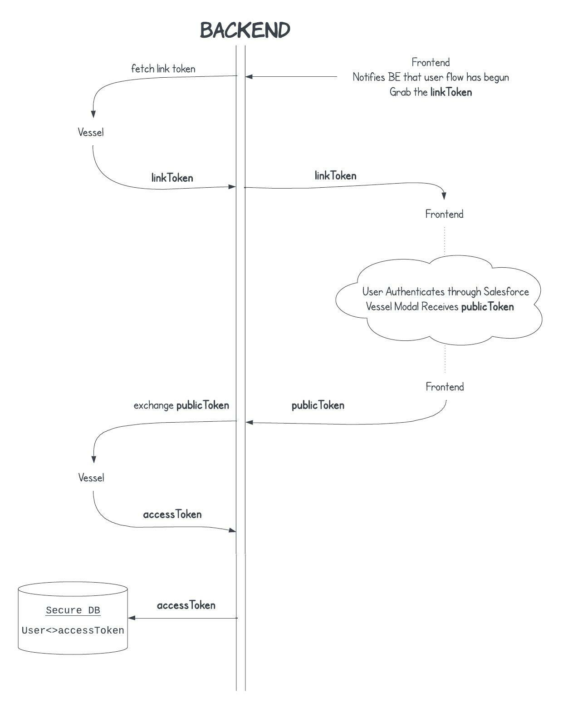
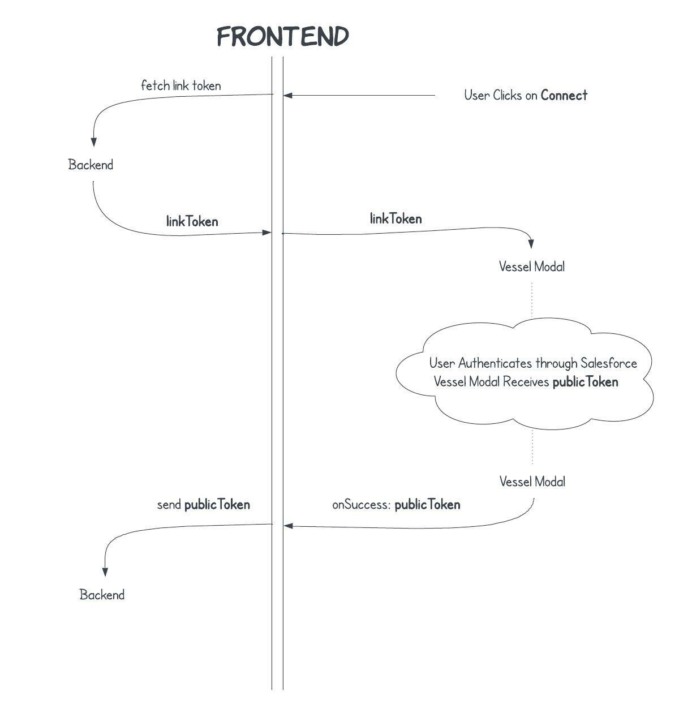

Here is a more detailed guide on how to setup your frontend and backend
to create a new connection. The authentication process is a bit more
complicated than the typical auth flow, but it is necessary to
ensure the privacy of your user's data.

Since this process is so unique to Unified API's,
don't fret if you're not familiar with it.

For this example we are going to assume the user is connecting their
Salesforce account, but this authentication flow works for any integration.

## Summary

Instead of going through the entire flow start to end, it makes more sense
to first look at each component in the process and play through the flow
at each step.

Before we dive into that, we will first go over the three tokens that are
being sent back and forth. In order from last to first, here are the tokens that are
being exchanged:

1. `accessToken`: This is the private secret used to query the Vessel API.
One of the goals of the authentication process is to never let the frontend
know what the `accessToken` is. This is sensitive data
and should be stored securely on the backend,
tied to your user's account.

2. `publicToken`: This is essentially the public counterpart of the `accessToken`.
This is what your frontend receives and will send to your backend. This is generated
once the user has authenticated their platform (e.g. Salesforce account). Your backend will then exchange this
for an `accessToken` and a `connectionId`.

3. `linkToken`: This is a temporary auth token to identify a session.
This is created when the user initiates the connection flow, even before they
have authenticated through their platform. It acts as a session link between the browser session
and Vessel's backend.

## Backend

From the backend's perspective, the flow looks like this:

1. The backend will be prompted by the frontend to ask Vessel for a `linkToken`.  
2. The `linkToken` will be sent over to the frontend.  
3. After a few moments, the frontend will return a `publicToken` to the backend.  
4. The backend will exchange the `publicToken` for an `accessToken`.  
5. The backend will store the `accessToken` _securely_ in the database
and tie it to the user account.



This means your backend needs to have two endpoints:

1. One for grabbing the `linkToken`.
```typescript
app.post("/link-token", async (req, res) => {
  // @reference https://docs.vessel.land/api-reference/link/create-link-token
  const response = await fetch("https://api.vessel.land/link/token", {
    method: "POST",
    headers: {
      "vessel-api-token": process.env.VESSEL_API_TOKEN,
    },
  });

  const body = await response.json();
  res.send({ linkToken: body.linkToken });
});
```

2. One for exchanging the `publicToken` for an `accessToken`.
```typescript
app.post("/store-token", async (req, res) => {
  const { publicToken } = req.body;
  // @reference https://docs.vessel.land/api-reference/link/exchange-tokens
  const response = await fetch("https://api.vessel.land/link/exchange", {
    method: "POST",
    headers: {
      "vessel-api-token": process.env.VESSEL_API_TOKEN,
    },
    body: JSON.stringify({
      publicToken,
    }),
  });
  const { connectionId, accessToken } = await response.json();
  await db.storeSecrets(accessToken, connectionId);

  res.send({ success: true });
});
```

## Frontend

From the frontend's perspective, the flow looks like this:

1. The user initiates a connection flow.
2. The frontend will ask the backend for a `linkToken`.
3. This `linkToken` will be used to summon the Vessel modal.
4. The Vessel modal will trigger an `onSuccess` callback
that provides the `publicToken`.
5. The `publicToken` will be sent to the backend.



This means your frontend needs to have two callbacks that
relay to the backend:
```typescript
function App() {

  // Grabbing a linkToken from the backend.
  const getLinkToken = async () => {
    const response = await fetch("https://my-company.api.com/link-token", {
      method: "POST",
    });
    const { linkToken } = await response.json();
    return linkToken;
  };

  // Relaying back the publicToken to the backend once the authentication
  // is complete.
  const onSuccess = async (publicToken) => {
    await fetch("https://my-company.api.com/store-token", {
      method: "POST",
      body: JSON.stringify({
        publicToken,
      }),
    });
  };

  // The VesselConnectButton will handle the rest of the flow.
  return (
    <VesselConnectButton
      onSuccess={onSuccess}
      getLinkToken={getLinkToken}
    />
  );
}
```

## Why is it like this?

This type of authentication flow can seem quite unusual at first.
The reason for this particular flow is that the user must interact
with their platform's authentication flow, which then talks directly
to Vessel's API. And so the sensitive information (i.e. `accessToken`)
is generated quite detached from the backend. The `publicToken` serves
as a bridge between the two.

## Feedback

If there was anything confusing about this process, please let us know!
Send over an email to [support@vessel.land](mailto:support@vessel.land)
and we will help you out. We are always striving to improve the clarity
of our documentation.
