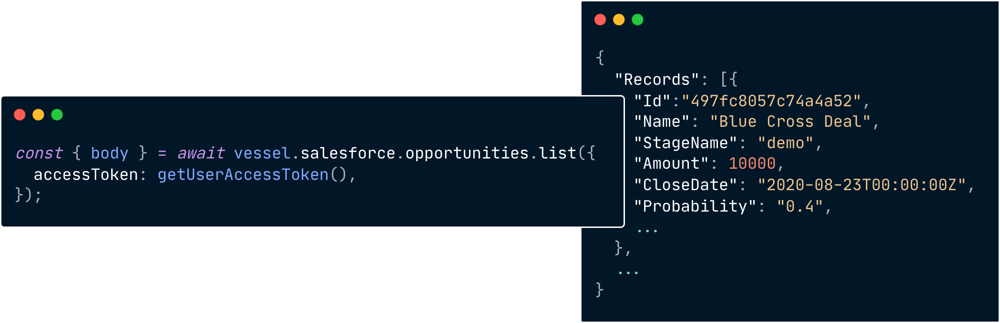

Vessel is a powerful embedded native integrations platform that allows you to build and deploy native Sales and Marketing integrations in minutes. At its core, the Vessel platform is a set of modules (actions, unification, and ETL) built on top of a rich [open source integrations library](https://github.com/vesselapi/integrations).

## Modules

Each module serves a different purpose and provides a different way to interact with your customer's data:

1. **Unification**: Unified APIs provide an abstraction on top of an entire vertical such as CRMs or Marketing Automation tools. Unified APIs make it easy to set up integrations with a large number of tools in a few lines of code by providing a single data schema and interface across common operations in a vertical.
2. **Actions**: Actions are abstractions on top of the integration's native APIs that provide an additional layer of schema validation, error handling, and typing. Together, these make working with the native integration's APIs far simpler and safer.
3. **Managed ETL**: ETL or Extract Transform and Load is the process of extracting data from one system and loading it into another, usually a database you have in-house. Vessel's ETL module provides a simple way to set up a data pipeline that will extract data (either raw or in a unified schema) from a connected integration and load it into a database of your choice.

If there's ever a case not covered by the modules (this is rare), Vessel provides a `/passthrough` endpoint for any integration or unified API to make an authenticated API call of any shape directly to the downstream provider.

## Integrations

For a full list of integrations we support you can check out our [integrations page](https://www.vessel.dev/integrations). We're adding new integrations constantly, but if there's an integration you need that we don't currently support you can add a [request here](https://vesselapi.canny.io/).

## At a Glance

The Vessel API was designed to be quick and easy to integrate into your product. Set up only requires a few lines of code - here's a high level over of what integrating Vessel looks like:

**Authenticate**: Authenticate with your users' GTM tool in a few lines of code.

<Frame>
  
</Frame>

**Unified API**: Leverage the unified schema to build integrations with many tools at once.

<Frame>
  
</Frame>

**Actions API**: Use the actions API to make typesafe calls to the native integration APIs.

<Frame>
  
</Frame>

## About us

We're a team of engineers and former engineers obsessed with building the best integrations platform in the world. We're passionate about building the best embedded integrations platform on the planet and obsess over the developer experience. If you have any questions, comments, feedback, or just want to chat about integrations don't hesitate to reach out to us at `support@vessel.dev`.

## Disclaimers

By using the Vessel API, you agree to our [Terms of Service](https://drive.google.com/file/d/1MAhix9lfQdMW7B600vYeMNtdY3vnQzIQ/view) and acknowledge our [Privacy Policy](https://drive.google.com/file/d/1AnNdqjvqEU_IhqhzSYUbAuk0nOEGJuNF/view).
