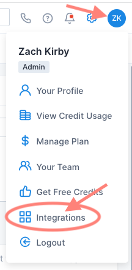
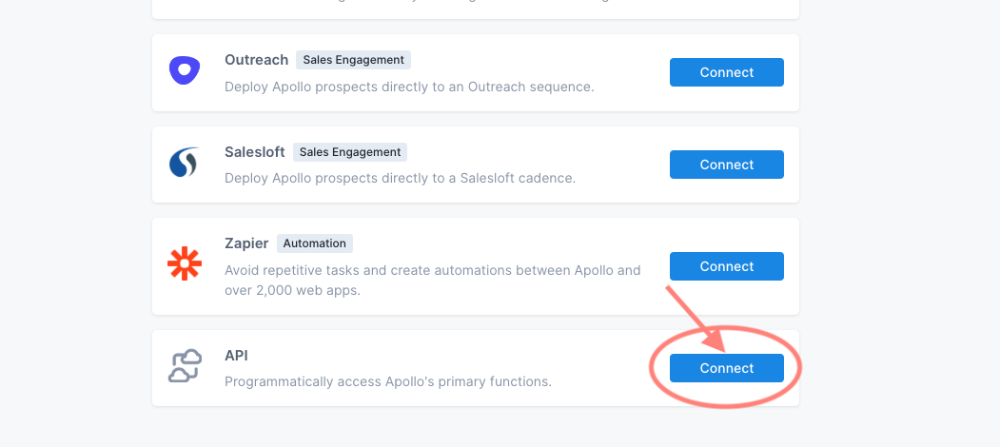
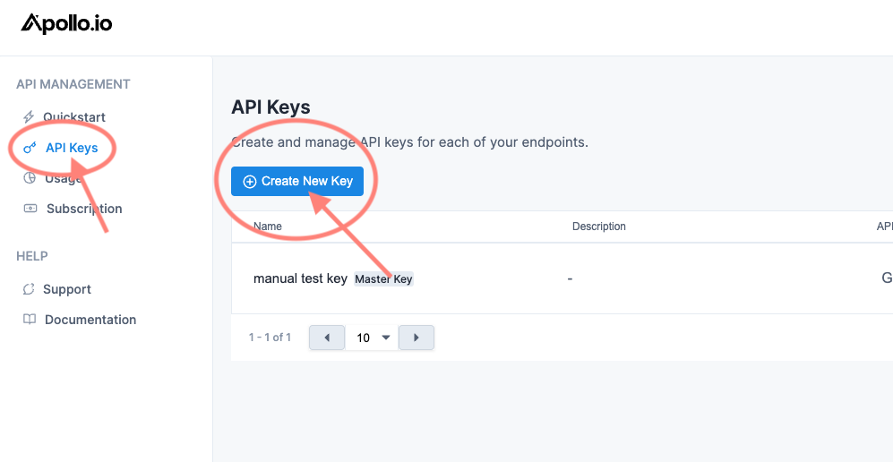
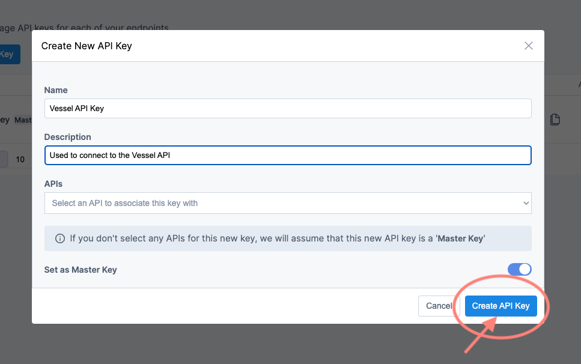
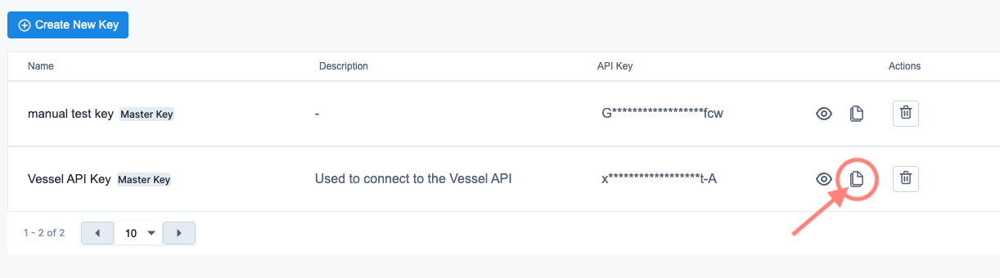
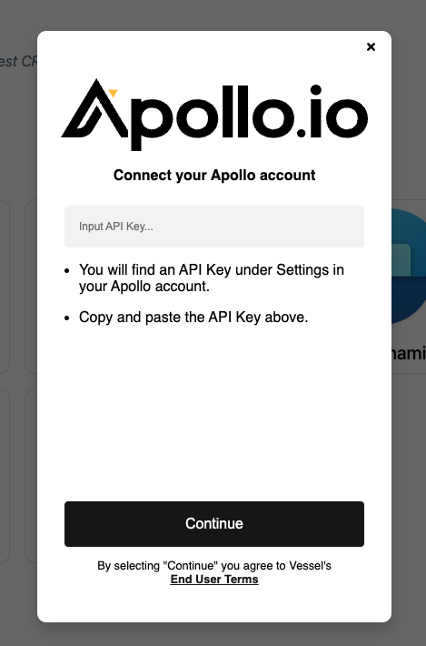

Step-by-step guide for creating an Apollo API key to connect to Apollo.

## Step 1: Navigate to the API key Page

Log-in to your Apollo account and navigate to the integrations page by clicking on your profile icon in the top right corner. There will be an "Integrations" page link near the bottom of the dropdown.

Scroll down to the bottom of the integrations page and find the card that says "API". Click on the Connect button.

## Step 2: Create your API key

Navigate to the "API Keys" tab on the left hand side of the page. Click on "Create a new API key".

Give your API a name (e.g., Vessel API key) and a description (e.g., Used to connect to the Vessel API) and click "create API key".

**_Important_**: Ensure that the "Set as Master Key" toggle is set to true (it will be set to true by default). Do not select any of the APIs or toggle the Master Key off. Vessel can only connect via a Master Key.

## Step 3: Connect using your API key

Click on the copy API key button.

Navigate back to the "Connect your Apollo account" modal and paste your API key into the API key field. Click "Continue" and you're done!

